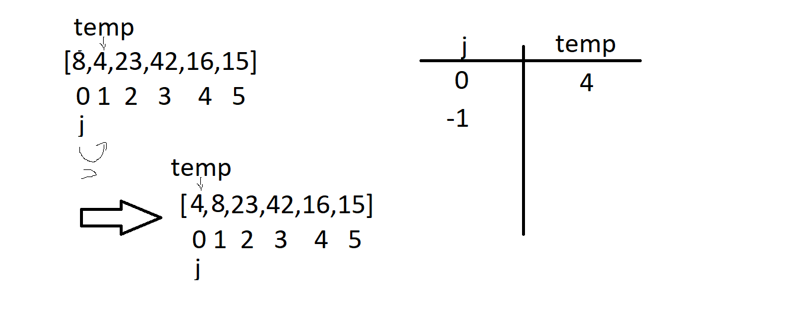
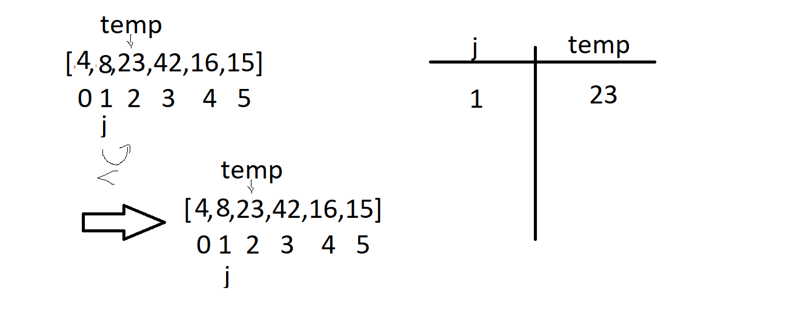
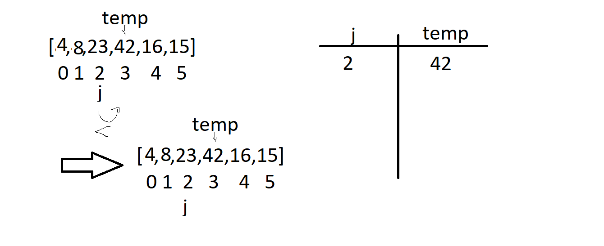
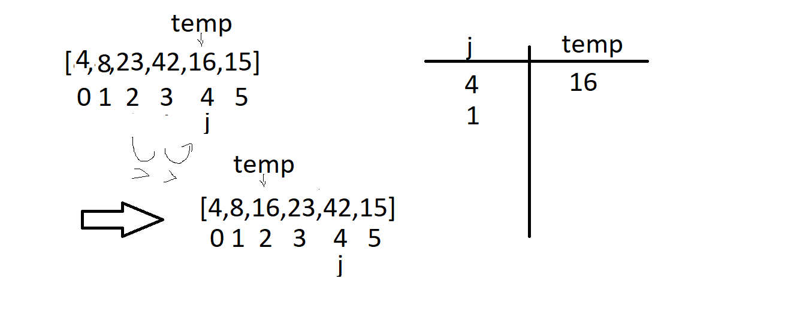
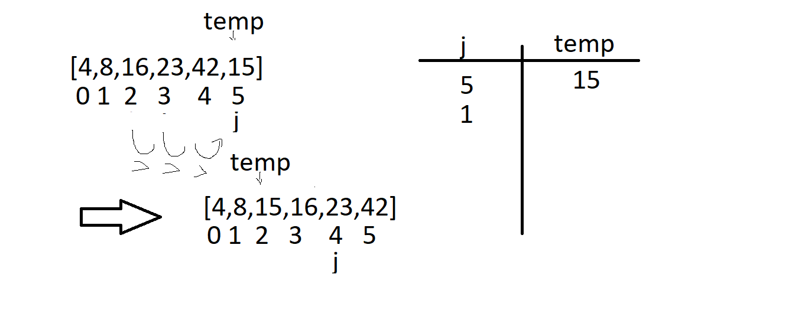

```
  InsertionSort(int[] arr)

    FOR i = 1 to arr.length

      int j <-- i - 1
      int temp <-- arr[i]

      WHILE j >= 0 AND temp < arr[j]
        arr[j + 1] <-- arr[j]
        j <-- j - 1

      arr[j + 1] <-- temp
```

Sample Array: [8,4,23,42,16,15]




Pass 1:
In the first Pass, the second value is set as temp and then compared to the value on the left if it is smaller, in this case it was actually smaller so a switch was made in the places of the values.


Pass 2:
In the second Pass, the second value is set as temp and then compared to the value on the left if it is smaller, in this case it was not actually smaller so a switch was not made in the places of the values.



Pass 3:
In the third Pass, the third value is set as temp and then compared to the value on the left if it is smaller, in this case it was not actually smaller so a switch was not made in the places of the values.



Pass 4:
In the fourth Pass, the fourth value is set as temp and then compared to the values on the left if it is smaller, in this case it was actually smaller at until index 1 so a switch was  made in the places of the values.



Pass 5:
In the fifth Pass, the fifth value is set as temp and then compared to the values on the left if it is smaller, in this case it was actually smaller at until index 1 so a switch was  made in the places of the values.
