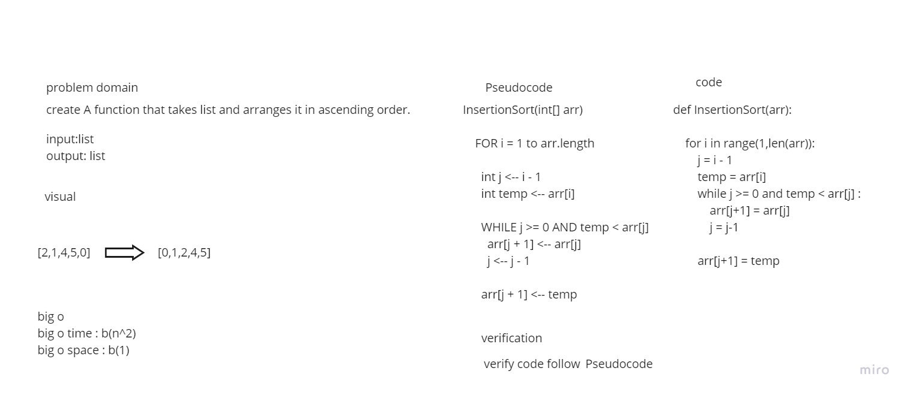

# Challenge Summary
create A function that takes list and arranges it in ascending order.
## Whiteboard Process

## Approach & Efficiency
Simple, quick and direct Approach have been taken


## Solution

```
arr = [2, 3, 5, 7, 13, 11]
    InsertionSort(arr)
```
