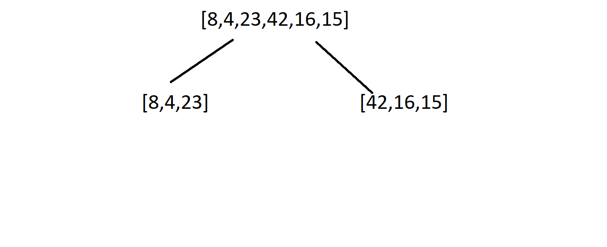
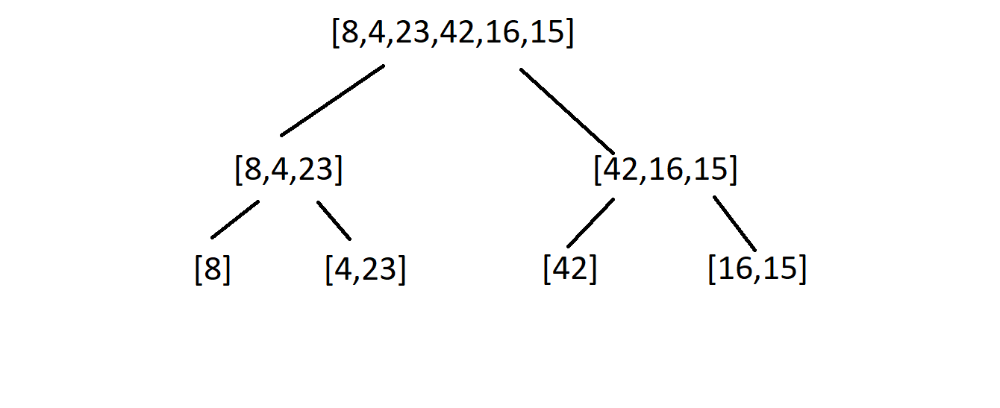
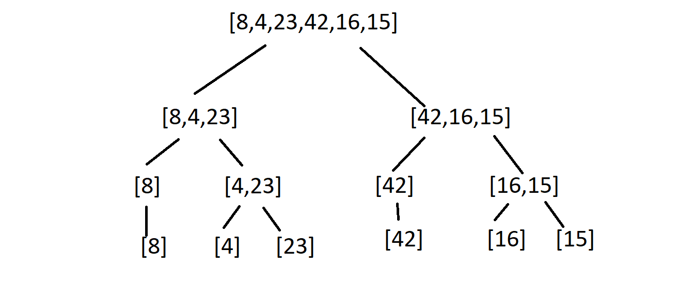
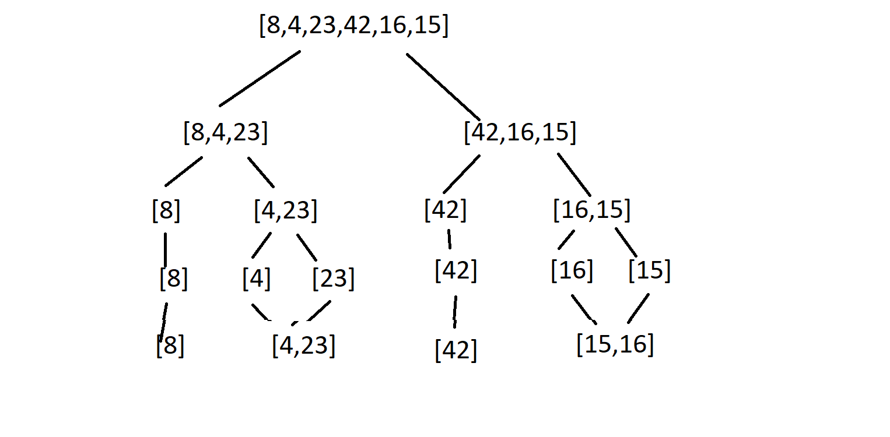
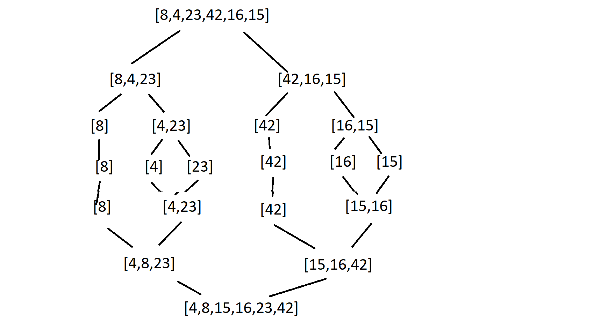

```
ALGORITHM Mergesort(arr)
    DECLARE n <-- arr.length

    if n > 1
      DECLARE mid <-- n/2
      DECLARE left <-- arr[0...mid]
      DECLARE right <-- arr[mid...n]
      // sort the left side
      Mergesort(left)
      // sort the right side
      Mergesort(right)
      // merge the sorted left and right sides together
      Merge(left, right, arr)

ALGORITHM Merge(left, right, arr)
    DECLARE i <-- 0
    DECLARE j <-- 0
    DECLARE k <-- 0

    while i < left.length && j < right.length
        if left[i] <= right[j]
            arr[k] <-- left[i]
            i <-- i + 1
        else
            arr[k] <-- right[j]
            j <-- j + 1

        k <-- k + 1

    if i = left.length
       set remaining entries in arr to remaining values in right
    else
       set remaining entries in arr to remaining values in left
```

Sample Array: [8,4,23,42,16,15]




Pass 1:
In the first Pass, The list is divided into two halves because it have length more than 1.




Pass 2:
In the secund Pass, The lists is divided because left and right lists have length more than 1.



Pass 3:
In the third Pass, The all lists is divided into two one value because left and right lists have length more than 1.



Pass 4:
After every divided list has a length equal to 1 the comparison begins.



Pass 5:
After the comparison process, the process of merge the list begins after all comparisons are completed the new sorted list is completed.
