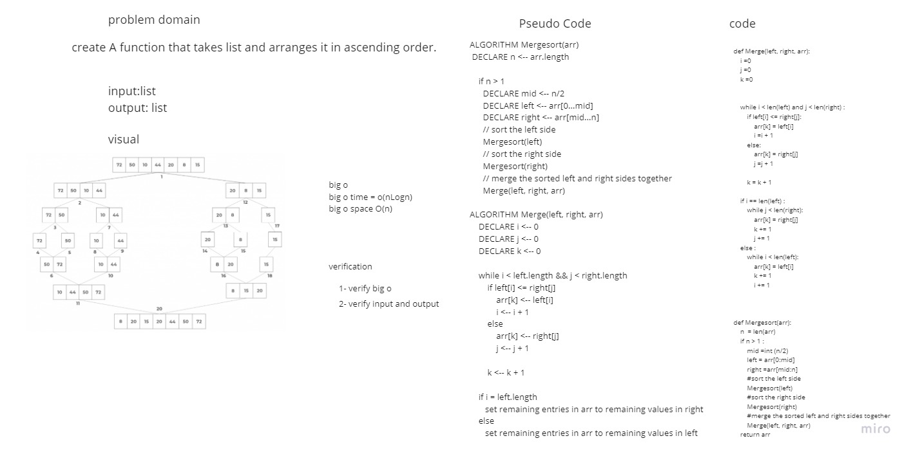

# Challenge Summary
create a function that takes list and arranges it in ascending order.

## Whiteboard Process



## Approach & Efficiency

Simple, quick and direct Approach have been taken

## Solution

```
arr =arr = [8, 4, 23, 42, 16, 15]
    Mergesort(arr)
```
