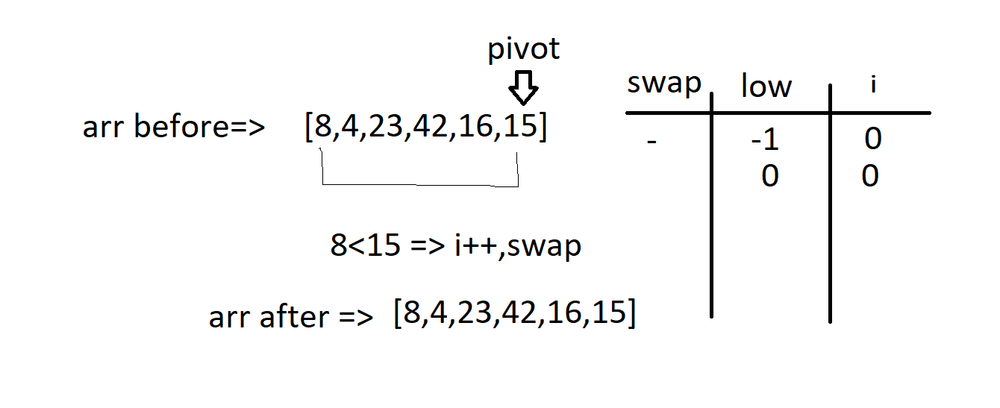
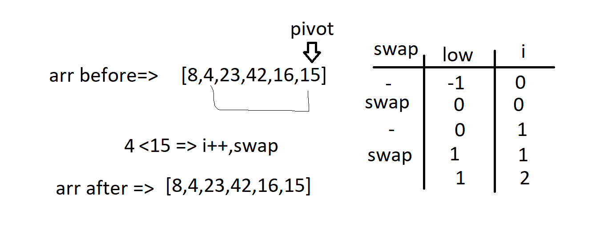
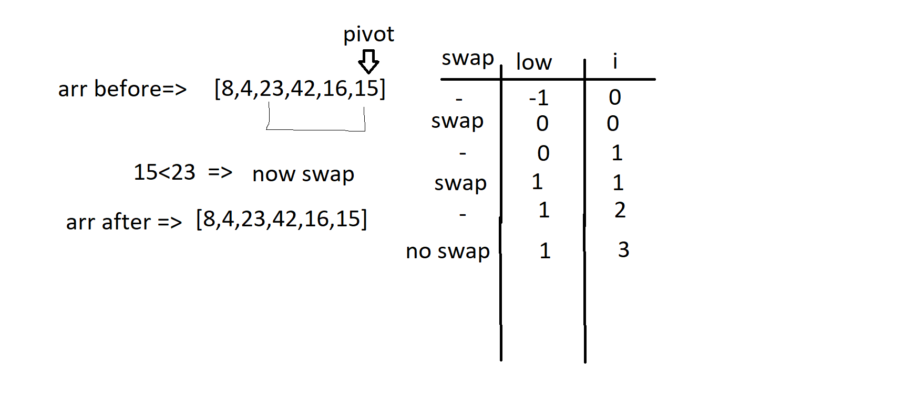
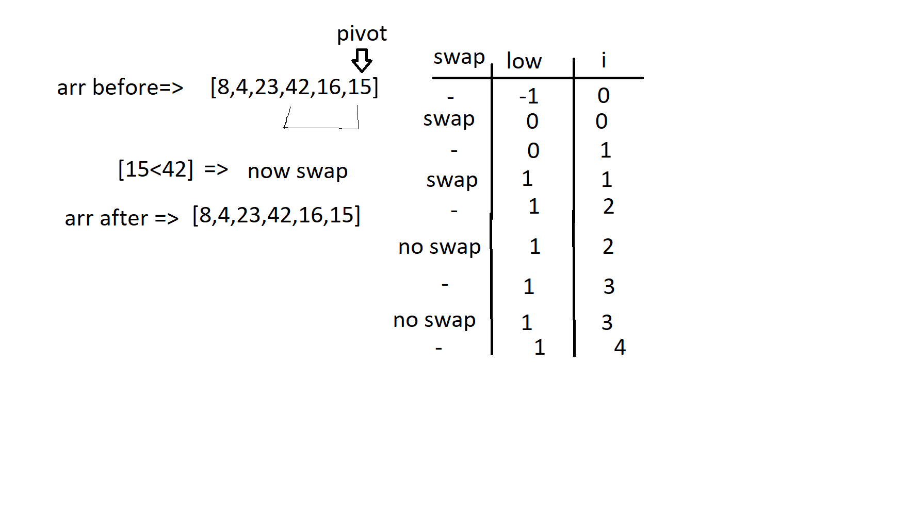
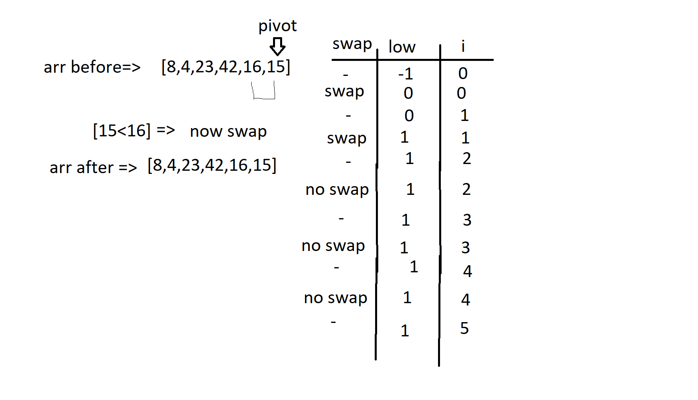
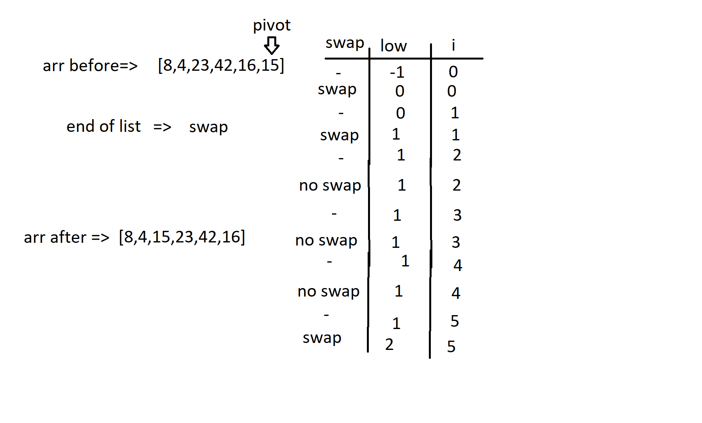
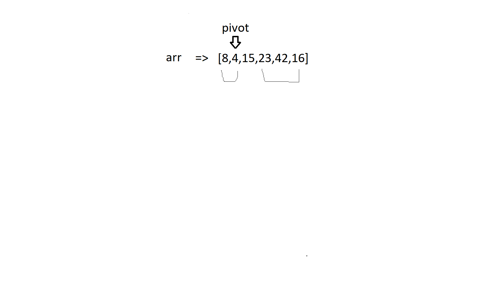

## Pseudo Code


```
ALGORITHM QuickSort(arr, left, right)
    if left < right
        // Partition the array by setting the position of the pivot value
        DEFINE position <-- Partition(arr, left, right)
        // Sort the left
        QuickSort(arr, left, position - 1)
        // Sort the right
        QuickSort(arr, position + 1, right)

ALGORITHM Partition(arr, left, right)
    // set a pivot value as a point of reference
    DEFINE pivot <-- arr[right]
    // create a variable to track the largest index of numbers lower than the defined pivot
    DEFINE low <-- left - 1
    for i <- left to right do
        if arr[i] <= pivot
            low++
            Swap(arr, i, low)

     // place the value of the pivot location in the middle.
     // all numbers smaller than the pivot are on the left, larger on the right.
     Swap(arr, right, low + 1)
    // return the pivot index point
     return low + 1

ALGORITHM Swap(arr, i, low)
    DEFINE temp;
    temp <-- arr[i]
    arr[i] <-- arr[low]
    arr[low] <-- temp
```


Sample Array: [8,4,23,42,16,15]





pass 1 :

In the first pass , the last value on the right was placed as an pivot for comparison, and then that value was compared with the first element in the list that had the lower value than pivot, so a switch was made, but since the indexes is equal there was no change in the order of the list.





pass 2 :

In the secund pass , the last value on the right still placed as an pivot for comparison, and then that value was compared with the secund element in the list that had the lower value than pivot, so a switch was made, but since the indexes is equal there was no change in the order of the list.




pass 3 :

In the third pass , the last value on the right still placed as an pivot for comparison, and then that value was compared with the third element in the list that had the bigger value than pivot, so a switch was not made.




pass 4 :

In the fourth pass , the last value on the right still placed as an pivot for comparison, and then that value was compared with the fourth element in the list that had the bigger value than pivot, so a switch was not made.





pass 5 :

In the Fifth pass , the last value on the right still placed as an pivot for comparison, and then that value was compared with the Fifth element in the list that had the bigger value than pivot, so a switch was not made.





pass 6 :

In the sixth pass , the end of the list has been reached. Therefore, the pivot should be placed in the middle of the list, with everything less than it to the left and everything greater than it to the right.





pass 7 :

Now the same steps are repeated for the left list and then the right, until the list is arranged.
