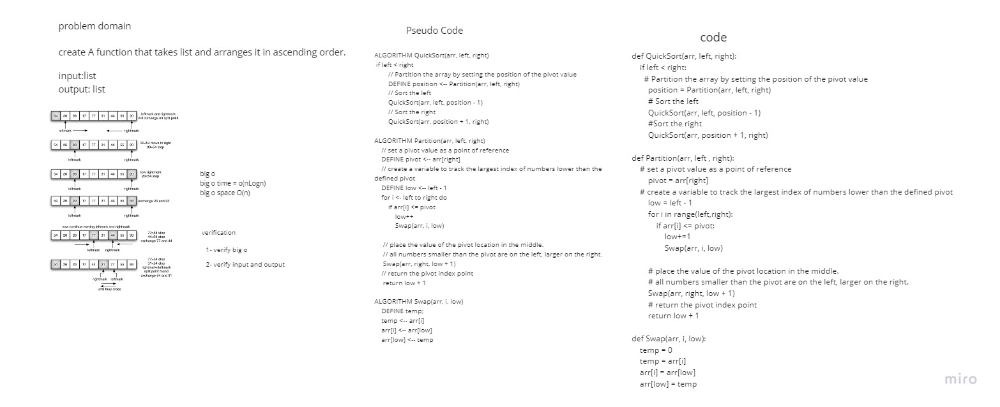

# Challenge Summary
create a function that takes list and arranges it in ascending order.

## Whiteboard Process



## Approach & Efficiency

Simple, quick and direct Approach have been taken


## Solution

```
    arr = [8,4,23,42,16,15]
    print(arr)
    QuickSort(arr, 0, len(arr)-1)
    print(arr)
```
