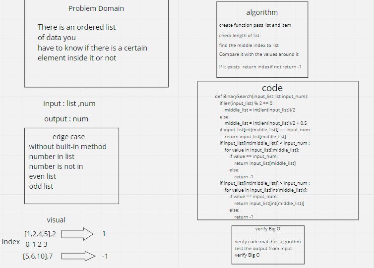

# Binary Search of Sorted Array

There is an ordered list
of data you
have to know if there is a certain
element inside it or not

## Whiteboard Process

## Approach & Efficiency
What approach did you take? Discuss Why
.
I chose the method that I thought was more appropriate and with a little complexity

What is the Big O space/time for this approach?

Big O time = O(n)
Big O space = O(1)

