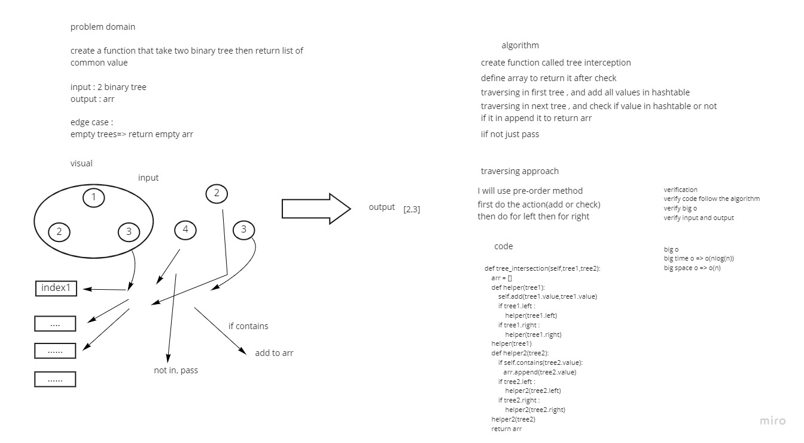

# Challenge Summary
Find common values in 2 binary trees.

## Whiteboard Process

## Approach & Efficiency
Simple, quick and direct Approach have been taken

big o time => o(nlog(n))
big o space => o(n)

## Solution

`hash = HashTable()
 hash.tree_intersection(tree1.root,tree2.root)
`
