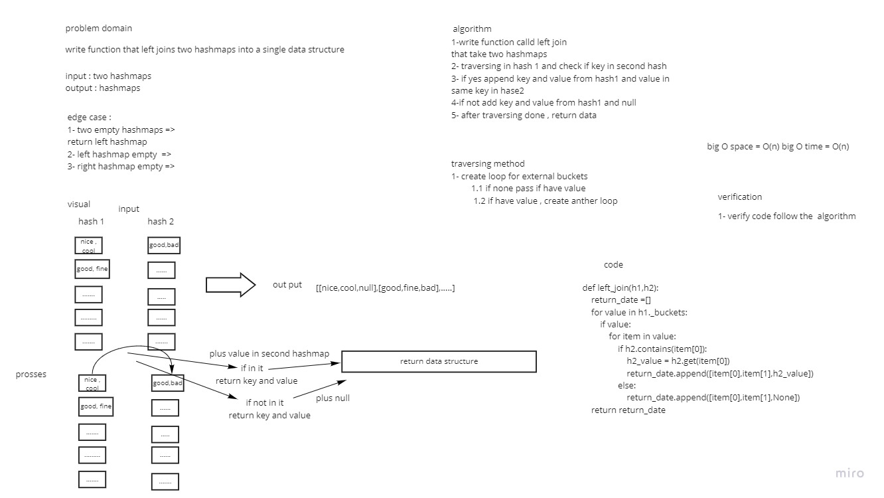

## Challenge Summary
Write a function that LEFT JOINs two hashmaps into a single data structure.


## Whiteboard Process


## Approach & Efficiency
Simple, quick and direct Approach have been taken big O space = O(n) big O time = O(n)

## Solution

```
    hash1 = HashTable()
    hash1.add('good','fine')

    hash2 = HashTable()
    hash2.add('good','bad')

    left_join(hash1, hash2)

```
