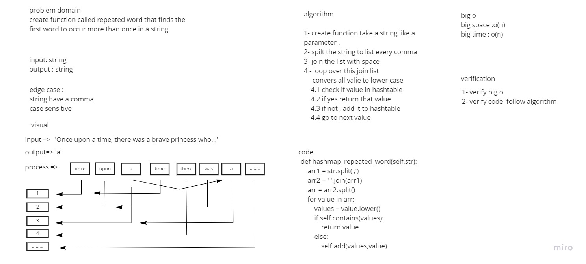

# Challenge Summary
Write a function called repeated word that finds the first word to occur more than once in a string.
## Whiteboard Process

## Approach & Efficiency
Simple, quick and direct Approach have been taken big O space = O(n) big O time = O(n)


## Solution
1. create a new Objict from Hashtable
2. call a function called  hashmap repeated word


```
    hash = HashTable()
    str="It was a queer, sultry summer, the summer they electrocuted the Rosenbergs, and I didn’t know what I was doing in New York..."
    hash.hashmap_repeated_word(str)
```
