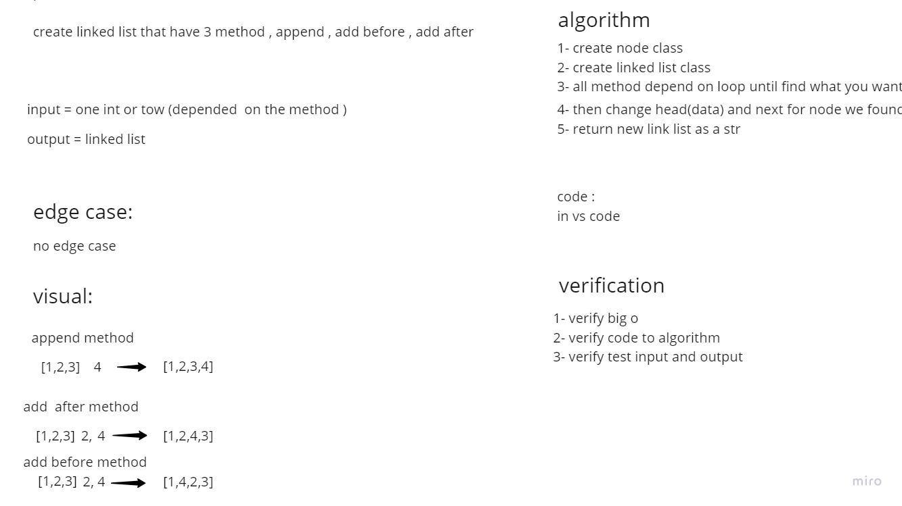

# Challenge Summary
The challenge was to add an item to Linked List.
It is required to do this in 3 different ways
1- Always add at the end of the list link
2- Addition depends on adding after an existing element
3- Addition depends on adding before an existing element

## Whiteboard Process


## Approach & Efficiency
Simple, quick and direct Approach have been taken


## Solution
You have to create Linked List and then you can use the methods in it

example :

```
node = LinkedList()
node.insert(4)
node.append(3)
print(node)
```
