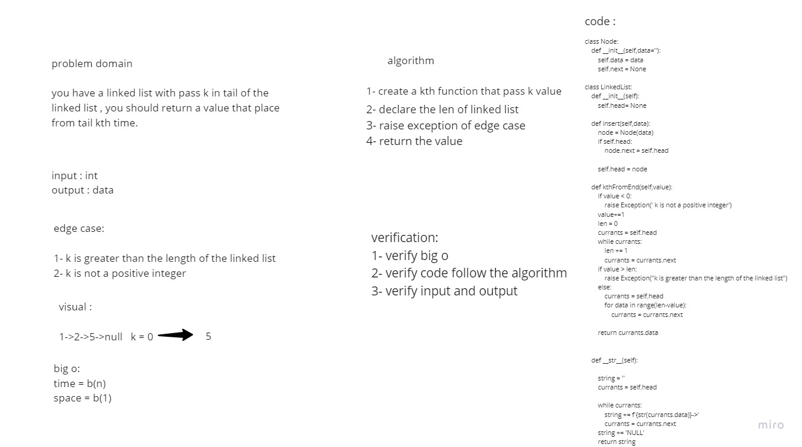

# Challenge Summary
you have a linked list with pass k in tail of the linked list , you should return a value that place from tail kth time.

## Whiteboard Process



## Approach & Efficiency
Simple, quick and direct Approach have been taken

## Solution
You have to pass k to Linked List

```
x.insert(4)
x.insert(5)
print(x)
print(x.kthFromEnd(0))
```


