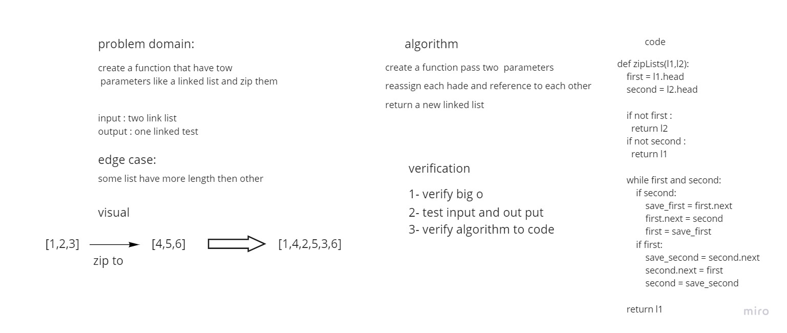

# Challenge Summary
create a function that have tow
parameters like a linked list and zip them
## Whiteboard Process


## Approach & Efficiency
Simple, quick and direct Approach have been taken

## Solution
pass two linked list

```
    y.insert(1)
    y.insert(2)
    y.insert(3)
    x = Linked_List()
    x.insert(4)
    x.insert(5)
    x.insert(6)
    zipLists(x,y)
```
