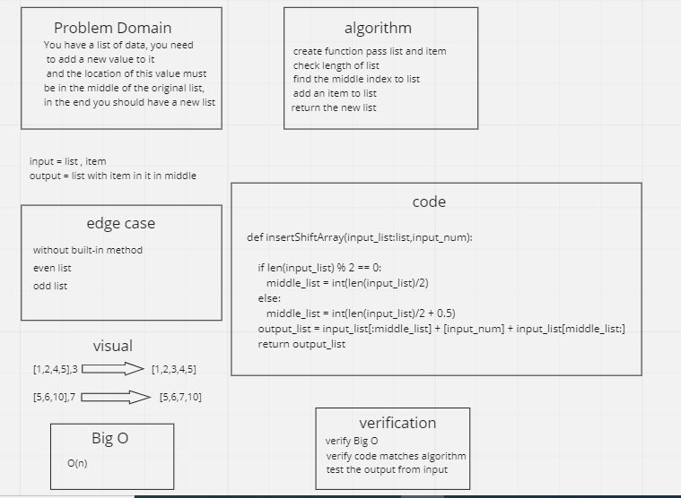

# Insert to Middle of an Array
You have a list of data, you need
 to add a new value to it
 and the location of this value must
be in the middle of the original list,
in the end you should have a new list

## Whiteboard Process

## Approach & Efficiency
 <!-- What approach did you take? Discuss Why. -->
There are several ways to solve, I used this method to get away from using built-in functions

<!-- What is the Big O space/time for this approach? -->
Big O space : B(n)
Big O time  : B(1)
