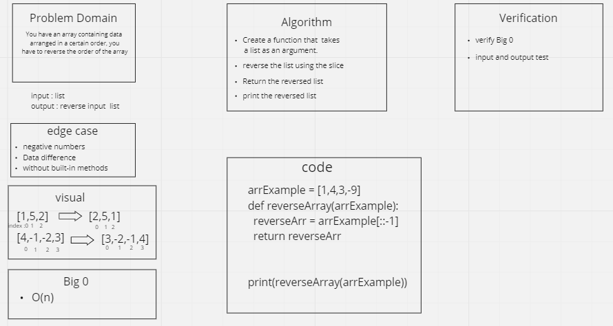

# Reverse an Array

You have an array containing data
 arranged in a certain order, you
 have to reverse the order of the array

## Whiteboard Process

## Approach & Efficiency

` What approach did you take? Discuss Why.`

There are several ways to solve it, it was not allowed to use the built-in methods, so I used the slide, and this gave me clean code and one.

` What is the Big O space/time for this approach?`

Big O time : O(n)
Big O space : O(1)

