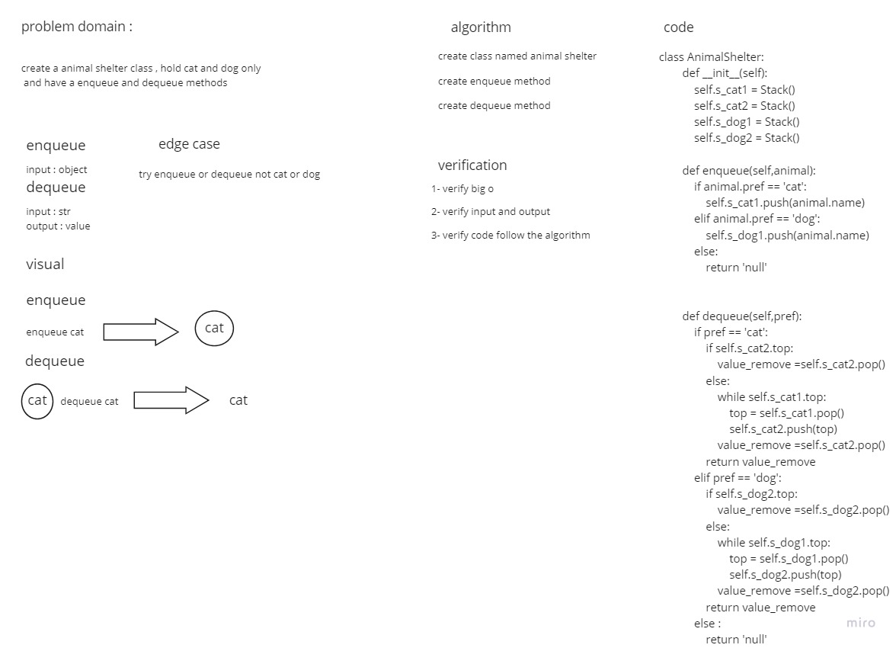

# Challenge Summary
Create a class called AnimalShelter which holds only dogs and cats.
## Whiteboard Process

## Approach & Efficiency
Simple, quick and direct Approach have been taken


## Solution
You have to create AnimalShelter and pass to it ether cat or dog

```
   animal = AnimalShelter()
    cat = Cats('minmin')
    animal.enqueue(cat)
    excepted = 'minmin'
```
