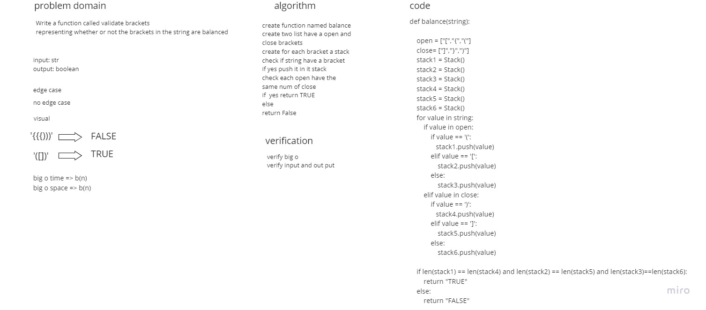

# Challenge Summary
Write a function called validate brackets
representing whether or not the brackets in the string are balanced

## Whiteboard Process


## Approach & Efficiency
Simple methods have been taken to ensure big o time equal to o(1)


## Solution
this ex will be false
```
balance('{{{)))')
```
