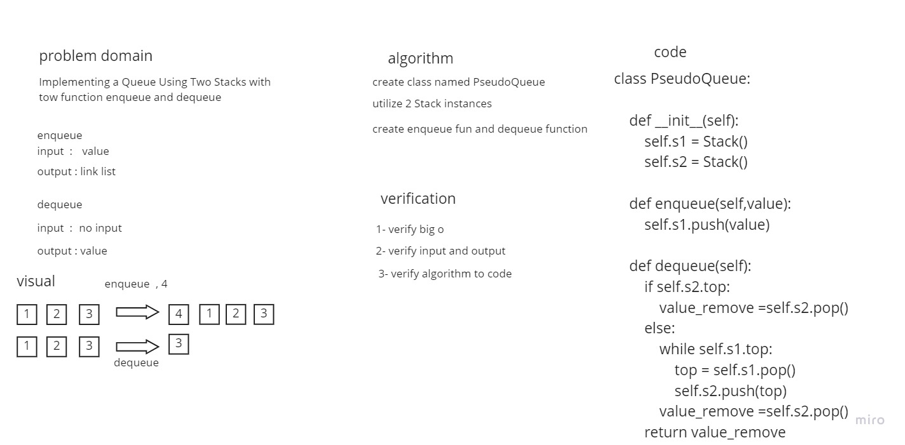

# Challenge Summary
Implementing a Queue Using Two Stacks

## Whiteboard Process


## Approach & Efficiency
Simple, quick and direct Approach have been taken


## Solution
make obj from class and call fun
```
node = PseudoQueue()
    node.enqueue(10)
```
