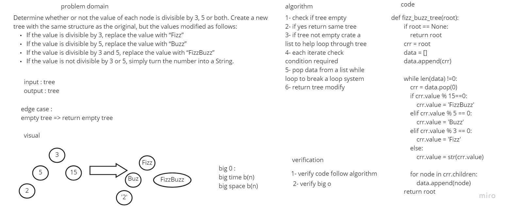

# Challenge Summary
Determine whether or not the value of each node is divisible by 3, 5 or both. Create a new tree with the same structure as the original, but the values modified
## Whiteboard Process


## Approach & Efficiency
Simple, quick and direct Approach have been taken

## Solution
```
tree= KTree()
    tree.root = Node(3)
    tree.root.children.append(Node(5))
```
