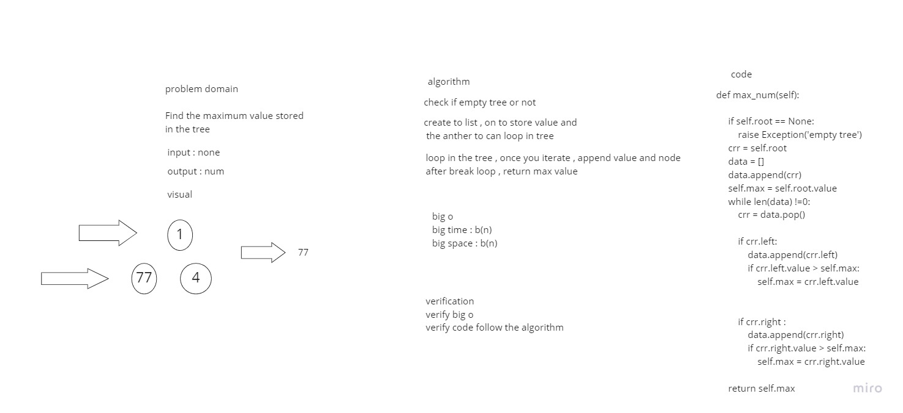

# Challenge Summary
Find the maximum value stored in the tree.

## Whiteboard Process


## Approach & Efficiency
Simple, quick and direct Approach have been taken


## Solution

```
 x = BinaryTree()
 x.insert(111)
 x.insert(6)
 x.insert(333)
 x.max_num(x.root)
```
