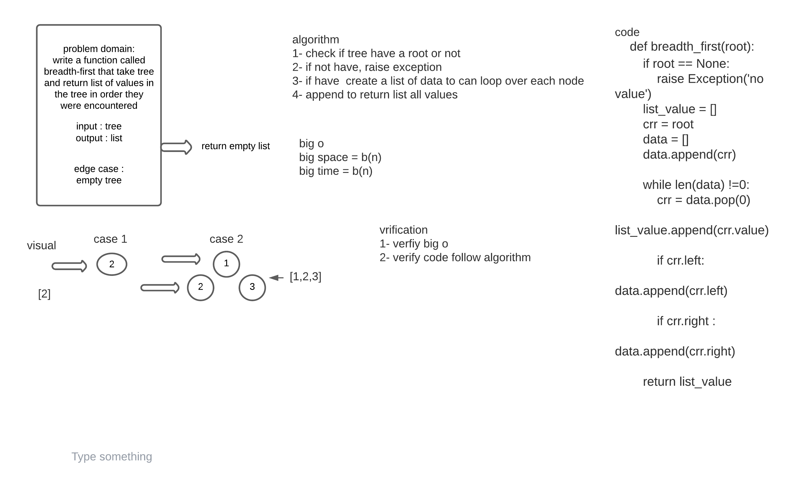

# Challenge Summary
write a function called breadth-first that take tree and return list of values in the tree in order they were encountered
## Whiteboard Process

## Approach & Efficiency
Simple, quick and direct Approach have been taken


## Solution
```
  tree = BinaryTree()
    tree.root = Node(2)
    tree.root.left = Node(7)
```
